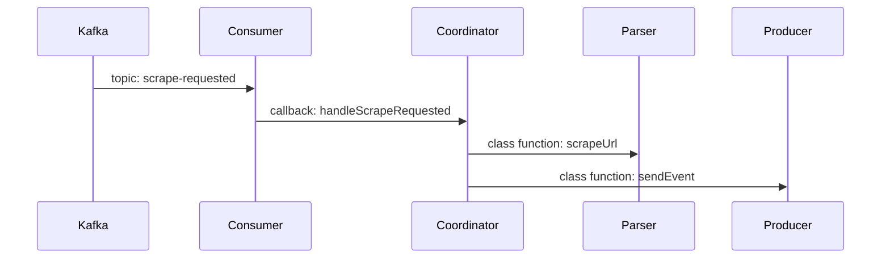

```mermaid
sequenceDiagram
Kafka->>Consumer: topic: scrape-requested
Consumer->>Coordinator: callback: handleScrapeRequested
Coordinator->>Parser: class function: scrapeUrl
Coordinator->>Producer: class function: sendEvent
```