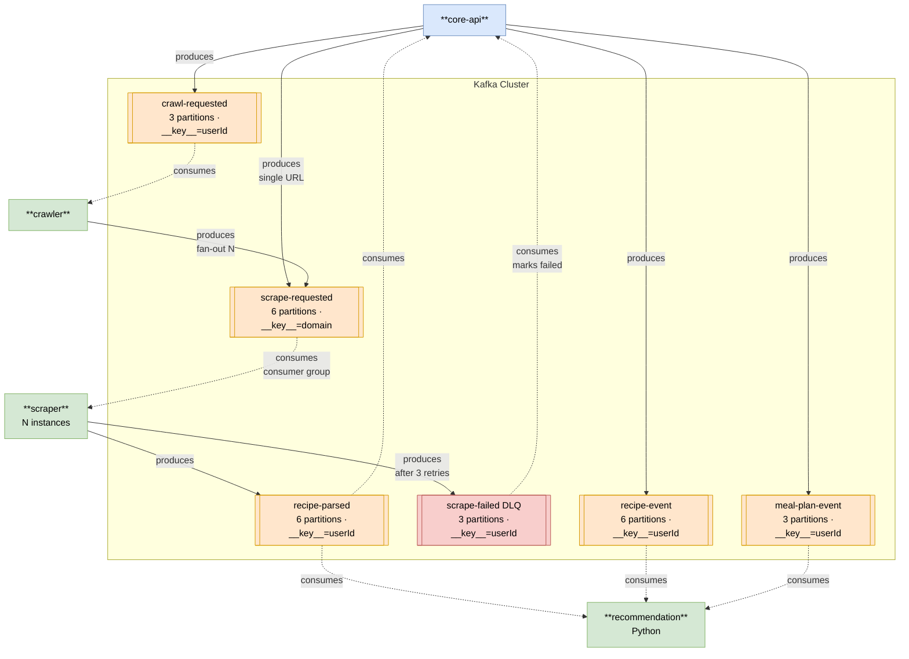

```mermaid
flowchart TB
    %% ── Services ──────────────────────────────────────────────────
    coreapi["**core-api**"]
    crawler["**crawler**"]
    scraper["**scraper**<br>N instances"]
    rec["**recommendation**\nPython"]

    %% ── Topics ────────────────────────────────────────────────────
    subgraph kafka["Kafka Cluster"]
        direction TB
        t_crawl[["crawl-requested<br> 3 partitions · __key__=userId"]]
        t_scrape[["scrape-requested<br> 6 partitions · __key__=domain"]]
        t_parsed[["recipe-parsed<br> 6 partitions · __key__=userId"]]
        t_dlq[["scrape-failed DLQ<br> 3 partitions · __key__=userId"]]
        t_revent[["recipe-event<br> 6 partitions · __key__=userId"]]
        t_meal[["meal-plan-event<br> 3 partitions · __key__=userId"]]
    end

    %% ── Produce arrows (solid) ────────────────────────────────────
    coreapi -->|"produces"| t_crawl
    coreapi -->|"produces\nsingle URL"| t_scrape
    crawler -->|"produces\nfan-out N"| t_scrape
    scraper -->|"produces"| t_parsed
    scraper -->|"produces\nafter 3 retries"| t_dlq
    coreapi -->|"produces"| t_revent
    coreapi -->|"produces"| t_meal

    %% ── Consume arrows (dashed) ───────────────────────────────────
    t_crawl -.->|"consumes"| crawler
    t_scrape -.->|"consumes\nconsumer group"| scraper
    t_parsed -.->|"consumes"| coreapi
    t_parsed -.->|"consumes"| rec
    t_dlq -.->|"consumes\nmarks failed"| coreapi
    t_revent -.->|"consumes"| rec
    t_meal -.->|"consumes"| rec

    %% ── Styles ────────────────────────────────────────────────────
    classDef tsService fill:#dae8fc,stroke:#6c8ebf,color:#000
    classDef pyService fill:#d5e8d4,stroke:#82b366,color:#000
    classDef topic    fill:#ffe6cc,stroke:#d79b00,color:#000
    classDef dlq      fill:#f8cecc,stroke:#b85450,color:#000

    class gateway,coreapi tsService
    class crawler,scraper,rec pyService
    class t_crawl,t_scrape,t_parsed,t_revent,t_meal topic
    class t_dlq dlq

```